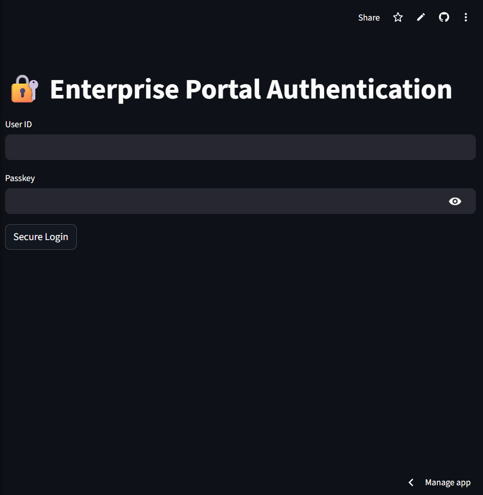
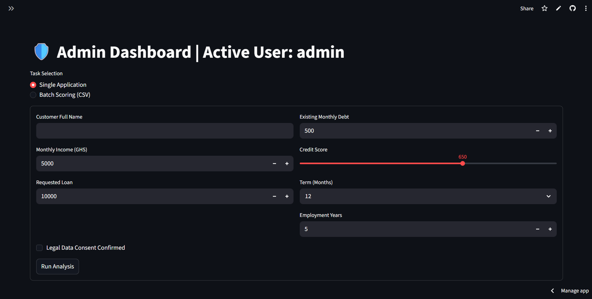
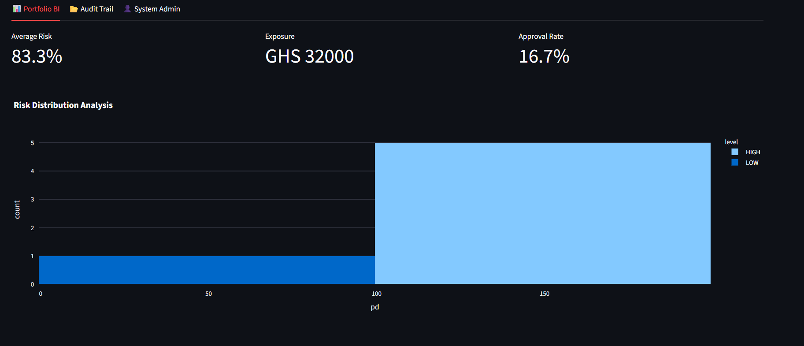
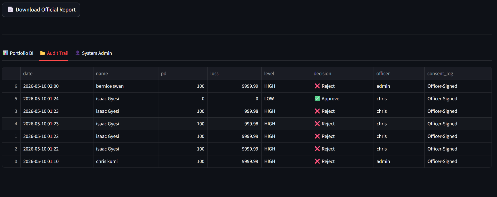

# ⚖️ Loan Risk Intelligence System
### *Enterprise-Grade FinTech Decision Platform*

**Loan Risk Intelligence System** is a sophisticated decision-support platform designed to automate and standardize credit risk assessment. By leveraging Machine Learning, the system enables financial institutions to evaluate borrower risk in real-time, quantify potential exposure, and maintain a rigorous audit trail for regulatory compliance.

---

## 💼 Business Value
* **Decision Automation:** Instantly categorizes applications into **Approve**, **Review**, or **Reject**.
* **Operational Efficiency:** Drastically reduces manual assessment time for loan officers.
* **Risk Mitigation:** Quantifies **Probability of Default (PD)** and **Expected Loss** using data-driven insights.
* **Regulatory Compliance:** Maintains a permanent, secure audit trail of every credit decision.
* **Portfolio Intelligence:** Provides executives with high-level BI on total exposure and risk distribution.

---

## 🚀 Core Features

### 🧠 AI Decision Engine
* **Predictive Analytics:** Calculates the statistical probability of default using Logistic Regression.
* **Explainable AI (XAI):** Identifies and displays the **Primary Risk Driver** (e.g., Credit Score, Debt-to-Income) for every decision, ensuring transparency.

### 👥 Role-Based Access Control (RBAC)
* **Admin:** Full system oversight, security configuration, and user provisioning.
* **Manager:** High-level access to Portfolio BI and full Audit Trail review.
* **Loan Officer:** Operational access for single application entry and batch scoring.

### 📊 Advanced Operations
* **Batch Processing:** Ability to upload CSV files to score hundreds of applications simultaneously with automated logging.
* **Portfolio BI Dashboard:** Real-time visual metrics including Average Risk, Total Exposure, and Approval Rates.
* **Automated Reporting:** Generates professional, customer-ready PDF risk reports with a single click.

### 🛡️ Security & Integrity
* **Data Protection:** Industrial-strength **SHA-256 password hashing**.
* **Persistence:** Secure SQLite implementation with hardened connection handling to prevent data corruption.

---

## 🛠️ Tech Stack
| Layer | Technology |
| :--- | :--- |
| **Frontend** | Streamlit |
| **Machine Learning** | Scikit-learn, Joblib |
| **Database** | SQLite |
| **Visualization** | Plotly Express |
| **Reporting** | FPDF |

---

## 🧠 System Architecture
1. **Model Training:** ML models are trained offline via `train_model.py` to optimize performance.
2. **Metadata Handshake:** The app utilizes a hardened metadata protocol to ensure feature alignment and prevent "silent failures" during prediction.
3. **Real-Time Interface:** A responsive Streamlit UI handles user inputs and triggers the analysis engine.

---

## 📊 Sample Analysis Output
> **Customer:** John Doe  
> **Probability of Default:** `42.7%`  
> **Expected Loss:** `GHS 3,500`  
> **Decision:** `⚠️ Review (Medium Risk)`  
> **Primary Driver:** `Credit Score`

---

## 🌐 Live Demo
[**Click Here to Access the Live Portal**](https://loan-risk-intelligence.streamlit.app/)  
*(Default Credentials: User: `admin` | Pass: `knust2026`)*
---

## 📸 System Screenshots

### 🛡️ User Authentication & Dashboard

### 🧠 AI Risk Analysis & Explainability

### 📊 Portfolio Business Intelligence

### 📑 Regulatory Audit Trail

---
---

## ⚠️ Disclaimer
This system is a decision-support tool powered by machine learning models. It is designed to complement—not replace—human credit judgment and institutional lending policies.

## 👨‍💻 Author
**Christian Kumi** *FinTech & Machine Learning Developer* Kwame Nkrumah University of Science and Technology (KNUST)
